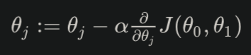
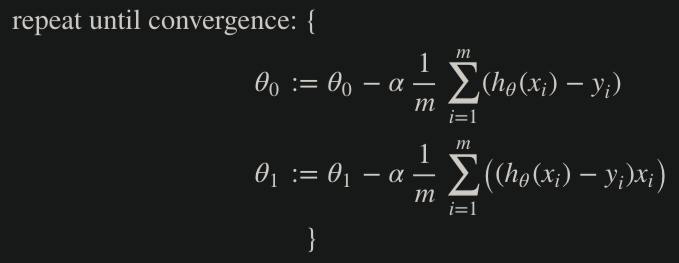

# Week 1 Notes

## Introduction

### Definitions of "Machine Learning"
- Field of study that gives computer the ability to learn without being explicitly programmed.
- A computer program is said to learn from experience E with respect to some class of tasks T and performance measure P, if its performance at tasks in T, as measured by P, improves with experience E.
    - Example: playing checkers. 
      E = the experience of playing many games of checkers 
      T = the task of playing checkers. 
      P = the probability that the program will win the next game.
### Supervised Learning
- Given a data set where we already know what the correct output is, having the idea that there is a relationship between input and output
- Categorized into "Regression" and "Classification" problems
#### Regression
- Trying to predict results within a continuous output, AKA mapping input variables to some continuous function (linear regression, quadratic, etc.)
- Example: Given a picture of a person, we have to predict their age on the basis of the given picture
#### Classification
- Trying to predict results in a discrete output, AKA map input variables into discrete categories
- Example: Given a patient with a tumor, we have to predict whether the tumor is malignant or benign
### Unsupervised Learning
- Allows us to approach problems with little or no idea what our results should look like
- Derive structure from data we don't necessarily know the effect of the variables (clustering)
- No feedback based on prediction results (no right or wrong answer as in classification)
#### Clustering
- Example: take a collection of 1,000,000 genes and find a way to automatically group these genes into groups that are somehow similar or related by different variables (lifespan, location, roles, etc.)
#### Non-Clustering
- Example: "Cocktail Party Algorithm": find structure in a chaotic environment (picking out individual voices and music from a mesh of sounds at a "cocktail party")

## Model and Cost Function

### Model Representation
- x(i) as "input" variables (input features) and y(i) as "output" variables (target variable that we are trying to predict)
- A pair (x(i), y(i)) is called a <b>training example</b>, dataset that we'll be using to learn = a list of <i>m</i> training examples for i = 1, 2, ..., <i>m</i> is called a <b>training set</b>
- 
- When target variable y(i) that we're trying to predict is continuous, we call the learning problem a <b>regression</b> problem, and when the target variable can take on only a small number of discrete values, we call it a <b>classification</b> problem
### Cost Function
- 
- Otherwise called "Squared error function" or "Mean Squared Error" (MSE)
    - The mean is halved (1/2) as convenience for computing gradient descent, since the derivative term of the square function will cancel out the 1/2 term.
#### Intuition 1
- Plotting our hypothesis on an x-y axis, our goal is to find the "line of best fit" for the data points that we have
- We can also plot our cost function J(&theta;1) to figure out what the "error" is if we set &theta;1 to some value, which in this case represents the slope of our hypothesis function
- 
- 
- 
    - Our goal here is to find the global minimum of our cost function, in this case J(&theta;1) is 0 when &theta;1 = 1
#### Intuition 2
- Using a contour plot, we can visualize what our cost function looks like for two input variables &theta;0 and &theta;1
    - The minimum of this function would be at the center most/center of the smallest ellipse 
- 
- 
- 

## Parameter Learning

### Gradient Descent
- If we plot our cost function J(&theta;0, &theta;1), we might get something like this: 

    - Our goal is to find a local minimum in this plot by making incremental steps towards that local minimum (imagine being on some part a hill and looking around you 360 degrees for the step that will allow you to make the most progress in the downhill direction)
- We can do this by initializing &theta;0 and &theta;1 to some value (say (0, 0)), and computing the following algorithm until we reach that local minimum (AKA convergence): 
 
where j = 0, 1 represents the feature index number
    - &alpha; represents the <b>learning rate</b>, which is essentially how large our "steps" are towards the local minimum
- At each iteration, we want to perform <b>Simultaneous Update</b> as shown here: 

### Gradient Descent Intuition
- Gradient Descent works because the derivative term will be negative if our &theta;j is to the left of the local minimum, meaning the equation will subtract a negative value, or <b>add</b> a positive value, to &theta;j, which will naturally move &theta;j to the right, and vice versa for if our &theta;j is to the right of our local minimum 

- We need to make sure our learning rate &alpha; is not too small or too large 

- We can fix our learning rate &alpha; because naturally our derivative term will get smaller and smaller as we approach our local minimum, which will have a derivative of 0 

### Gradient Descent for Linear Regression
- We can now substitute our cost function for our actual hypothesis function for linear regression and get the following algorithm: 

    - We get this by taking the partial derivative of our cost function with respect to &theta;j
    - In this example, we take the partial derivative of our cost function with respect to &theta;0 and &theta;1, which can be generalized to the following derivation: 
    
- If we repeatedly apply these gradient descents <b>simultaneously</b> to our equations for &theta;0 and &theta;0, our hypothesis will be come more and more accurate
- This method looks at all the data in the entire training set (summation over m terms), so it's also called <b>batch gradient descent</b> 

## Linear Algebra Review

