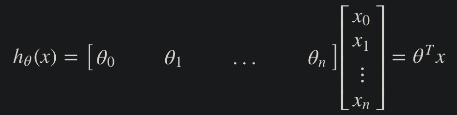

# Week 2 Notes

## Multivariate Linear Regression

### Multiple Features
- Linear regression with multiple variables = "multivariate linear regression"
- xj(i) = value of feature <i>j</i> in the <i>ith</i> training example
- x(i) = the input (features) of the <i>ith</i> training example
- m = the number of training examples
- n = the number of features
- Multivariable form of the hypothesis function
  - h&theta;(x) = &theta;0 + &theta;1x1 + &theta;2x2 + &theta;3x3 + ... + &theta;nxn
- We can think of this as &theta;0 as the basic price of a house, &theta;1 as the price per square meter, &theta;2 as the price per floor, etc., with x1 will be the number of square meters in the house, x2 the number of floors, etc.
- We can then vectorize our hypothesis function for one training example:
  - 
- 