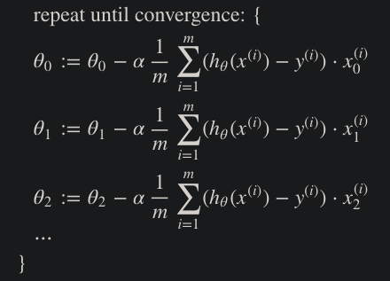
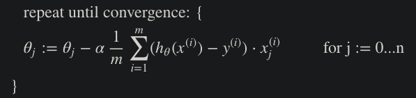
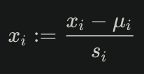
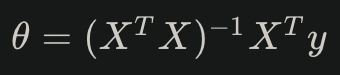
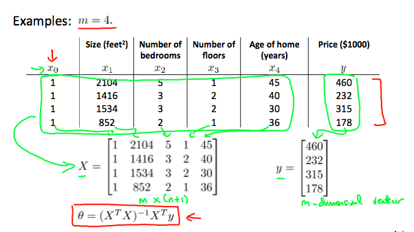
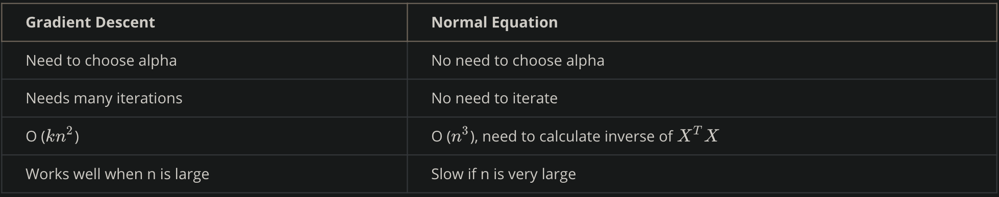

# Week 2 Notes

## Multivariate Linear Regression

### Multiple Features
- Linear regression with multiple variables = "multivariate linear regression"
- xj(i) = value of feature <i>j</i> in the <i>ith</i> training example
- x(i) = the input (features) of the <i>ith</i> training example
- m = the number of training examples
- n = the number of features
- Multivariable form of the hypothesis function
  - h&theta;(x) = &theta;0 + &theta;1x1 + &theta;2x2 + &theta;3x3 + ... + &theta;nxn
- We can think of this as &theta;0 as the basic price of a house, &theta;1 as the price per square meter, &theta;2 as the price per floor, etc., with x1 will be the number of square meters in the house, x2 the number of floors, etc.
- We can then vectorize our hypothesis function for one training example:
  
### Gradient Descent For Multiple Variables
- We repeat our gradient descent formula for 'n' features: 
   
   
  
### Gradient Descent in Practice I – Feature Scaling
- We can speed up gradient descent by limiting/scaling our input values to roughly the same range
  - This works because &theta; will descend quickly on small ranges and slowly on large ranges, and it will oscillate inefficiently down to the optimum when the variables are very uneven.
  - Ideally, we want to modify the ranges of our input such that: -1 &le; x(i) &le; 1, or -0.5 &le; x(i) &le; 0.5
  - Not exact requirements, but it will help speed things up
- <b>Feature Scaling</b> and <b>Mean Normalization</b> are two techniques to help speed up gradient descent
  - Feature Scaling: involves dividing the input values by the range (max - min), which results in a new range of just 1
  - Mean Normalization: subtracting the average value for an input variable from the values for that input variable (which results in a new average value of 0 for those updated input variables)
  -  
  where <i>&mu;i</i> is the <b>average</b> of all the values for feature (i) and <i>si</i> is the range of values (max - min) AKA the standard deviation.
### Gradient Descent in Practice II – Learning Rate
- Debugging gradient descent: make a plot of your cost function J(&theta;) over the number of iterations of gradient descent 
- Automatic convergence test: declare convergence if J(&theta;) decreases by less than some &epsilon; in one iteration, where &epsilon; is some small value such as 10-3
  - Difficult to choose this value in practice, however
- 
  - It is proven that if the learning rate &alpha; is sufficiently small, then J(&theta;) will decrease on every iteration
- If &alpha; is too small = slow convergence, if &alpha; too large = maybe not decrease and maybe not converge
### Features and Polynomial Regression
- We can improve our features and the form of our hypothesis in different ways:
  - <b>Combine</b> multiple features into one, for example instead of the frontage (length) and depth of the house as separate features, we can combine them into a single <b>area</b> feature that is just the product of the frontage * depth
  - <b>Change the behavior or curve</b> of our hypothesis function: if a data set doesn't necessarily conform to a linear function/model, we can use a quadratic, cubic, or any orders of polynomial functions.
    - This is called <b>Polynomial Regression</b>
    - An important thing to keep in mind is that <b>feature scaling</b> becomes very important in this case, since the range of your input values scaled by some order could start to vary very widely
      - Ex: a cubic hypothesis could look like this <i>h&theta; = &theta;0 + &theta;1x1 + &theta;2x12 + &theta;3x13</i>, which if x1 had a max value of 1000, x12 would have a max of 1,000,000, and x13 would have a max of 109
      - Because of this, we need to utilize feature scaling to make sure those values don't start varying too wide

## Computing Parameters Analytically

### Normal Equation
- We minimize J by explicitly taking its derivatives with respect to the &theta;J's and setting them to 0, allowing us to find the optimum theta without iteration 
 

- There is <b>no need</b> to do feature scaling with the normal equation, comparison of gradient descent and normal equation: 

- Computing the inversion of a matrix is approximately <i>O(n3)</i> in complexity, so if we have a very large number of features, normal equation will be slow (in practice, somewhere around n = 10,000 might be a good threshold)
### Normal Equation Noninvertability
- In Octave, we want to use the `pinv` function rather than `inv`, because `pinv` (pseudo-inverse) will compute the value of &theta; even if <i>XTX</i> is non-invertible (singular, degenerate)
- If <i>XTX</i> is <b>noniinvertible</b>, common causes might be having:
  - Redundant features, where two features are linearly dependent
  - Too many features (m &le; n) <-- In this case, delete some features or use "regularization"