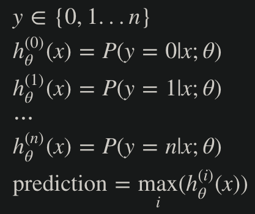
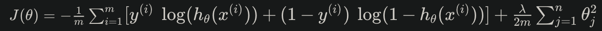

# Week 3 Notes

## Classification and Representation

### Classification
- Classification problems are like regression problems, except the values we want to predict take on only a small number of discrete values
  - For now, focus on **binary classification problem**, where *y* can only take on two values, 0 and 1
### Hypothesis Representation
- To fix our hypothesis function to satisfy 0 &le; *h&theta;(x)* &le; 1, we plug *&theta;Tx* into the Logistic Function
  - Our new form uses the "Sigmoid Function," also called the "Logistic Function: 
   
  
  - The function g(z) maps any real number to the (0, 1) interval, since as z approaches negative infinity, g(z) = 0, and as z approaches positive infinity, g(z) = 1
- *h&theta;(x)* will then give us the **probability** that our output is 1, e.g.: *h&theta;(x)* = 0.7 tells us that we have a probability of 70% that our output is 1
  - The probability that our prediction is 0 is just the **complement** of our probability that it is 1 
  
### Decision Boundary
- 
- **Decision Boundary**: the line that separates the area where y = 0 and where y = 1
  - Created by our hypothesis function
  - Example: 
   
    - This decision boundary is a straight vertical line placed on the graph where *x1* = 5, with everything to the left denoting y = 1, and everything to the right denoting y = 0
  - The input to the sigmoid function g(z) (e.g. *&theta;TX*) doesn't need to be linear, could be a function that describes a circle (e.g. *z = &theta;0 + &theta;1x12 + &theta;2x22*) or any shape to fit our data

## Logistic Regression Model

### Cost Function
- For logistic regression, our cost function must be **convex**, or always having a global minimum and no local minimum. Therefore, our function will look like: 
  
- 
- 
- Intuitively, if our correct answer *y* is 0 and we predict 0 (*h(x) = 0*), then our cost = 0. Similarly, if our correct answer *y* is 1 and we predict 1 (*h(x) = 1*), then our cost = 0.
- As our hypotheses approach 1 for y = 0 and/or 0 for y = 1, our const function will approach infinity
  - Note: writing our cost function in this way guarantees that J(&theta;) is convex for logistic regression
### Simplified Cost Function and Gradient Descent
- We can compress our cost function's two conditional cases into one case: *Cost(h&theta;(x),y) = -y log(h&theta;(x)) - (1 - y)log(1 - h&theta;(x))*
  - When y = 1, the second term will be 0 and will not affect the result, and similarly when y = 0, the first term will be 0 and will not affect the result
  - We can fully write out our cost function as follows: 
  
  - A vectorized implementation is: 
  
- 
### Advanced Optimization
- In order to use more sophisticated and highly optimized algorithms for computing &theta;, we can use Octave's native libraries to do so
- First, we need to provide a function that evaluates J(&theta;) (cost) and (d/d&theta;j)J(&theta;) (partial derivative of each term in &theta;)
  - We can write a single function that returns both of these:
  <pre><code>function [jVal, gradient] = costFunction(theta)
    jVal = [...code to compute J(theta)...];
    gradient = [...code to compute derivative of J(theta)...];
  end</code></pre>
  - We can then use Octave's "fminunc()" optimization algorithm along with the "optimset()" function that creates an object containing the options we want to send to "fminunc()":
  <pre><code>options = optimset('GradObj', 'on', 'MaxIter', 100);
  initialTheta = zeros(2,1);
     [optTheta, functionVal, exitFlag] = fminunc(@costFunction, initialTheta, options);</code></pre>
  - We give the function "fminunc()" our cost function, initial vector of theta values, and the "options" object that we created beforehand
 
## Multiclass Classification

### Multiclass Classification: One-vs-all
- Since y = {0, 1, ... n}, we divide our problem into n+1 (+1 because the index starts at 0) binary classification problems, each one we predict the probability that 'y' is a member of one of our classes (e.g. y = x for some class)
  - 
  - We are essentially choosing one class and lumping all the others into a single second class, and we do this repeatedly, applying binary logistic regression to each case, and then use the hypothesis that returned the highest value as our prediction
  - 

## Solving the Problem of Overfitting
- **Overfitting**: if we have too **many** features, the learned hypothesis may fit the training set very well, but fails to **generalize** well to predict on new data
- Addressing overfitting includes:
  - Reducing the number of features
    - Manually select which features to keep
    - Use a model selection algorithm (in later weeks)
  - Regularization
    - Keep all the features, but reduce the magnitude of parameters &theta;j
    - Regularization works well when we have a lot of slightly useful features
## Cost Function (Regularization)
- If we have overfitting from our hypothesis function, we can reduce the weight that some of the terms in our function carry by increasing their cost
- For example, say we wanted to make the hypothesis function more quadratic: *&theta;0 + &theta;1x + &theta;2x2 + &theta;3x3 + &theta;4x4*
  - We will want to eliminate the influence of *&theta;3x3* and *&theta;4x4* without actually getting rid of those features or changing the form of our hypothesis: 
    
  - 
- We could also regularize all of our theta parameters in a single summation: 
  
- The &lambda; is the **regularization parameter** that determines how much the costs of our theta parameters are inflated
  - If lambda is too large, it may smooth out the function too much and cause underfitting, and if lambda is too small, it may not have much affect on regularizing our hypothesis function
 ### Regularized Linear Regression
 #### Gradient Descent
  - We modify our gradient descent function to separate out *&theta;0* from the rest of the parameters because we do not want to penalize *&theta;0*: 
    
  - The term *(&lambda;/m)&theta;j* performs our regularization, and with some manipulation our update rule can be represented as:  
    
#### Normal Equation
- We can also approach regularization using the alternative method of the non-iterative normal equation. To add in regularization, the equation i the same as our original except that we add another term inside the parentheses: 
  
  - This equation should have dimension (n+1) x (n+1), and when we add the term &lambda; * L, *XTX + &lambda; * L* becomes invertible (in the case that m < n where *XTX* is non-invertible)
### Regularized Logistic Regression
- Our cost function for logistic regression was: 
  
  - We can regularize this equation by adding a term to the end: 
    
  - The second sum &Sigma;nj=1 **means to explicitly exclude** the bias term *&theta;0*, since the &theta; vector is indexed from 0 to n
  - 