# Week 4 Notes

## Neural Networks

### Model Representation I
- **Neurons** are basically computational units that take inputs (**dendrites**) as electrical inputs (called "spikes") that are channeled to outputs (**axons**)
  - In our model, dendrites are like the input features x1...xn, and the output is the result of our hypothesis function
  - In this model our x0 input node is sometimes called the "bias unit", always equal to 1
- We use the same logistic function as in classification, 1 / (1 + e-&theta;Tx), yet we sometimes call it a sigmoid (logistic) **activation** function
  - In this situation, our "theta" parameters are sometimes called "weights"
- Visually, a simplistic representation looks like: 
  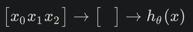
- Input nodes (layer 1), also known as the "input layer", go into another node (layer 2), and finally outputs the hypothesis function, known as the "output" layer"
  - We can have intermediate layers of nodes between the input and output layers called the "hidden layers"
  - We label these intermediate or "hidden" layer nodes a20...a2n and call them "activation units" 
    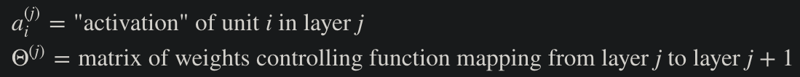
- One hidden layer would look like: 
  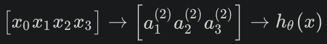
- Value for each activation node is as follows: 
  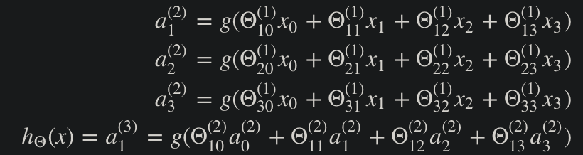
  - This is saying that we compute our activation nodes by using a 3x4 matrix of parameters
    - Apply each row of the parameters to our inputs to obtain the value for one activation node
    - Our hypothesis output is the logistic function applied tot he sum of the values of our activations nodes, which have been multiplied by yet another parameter matrix &Theta;(2) containing the weights for our second layer of nodes
    - Each layer gets its own matrix of weights, &Theta;(J)
    - The dimensions of these matrices of weigths is determined as follows: 
    *If network has sj units in layer j and sj+1 units in layer j+1, then &Theta;(j) will be of dimension sj+1 x (sj + 1)*
- 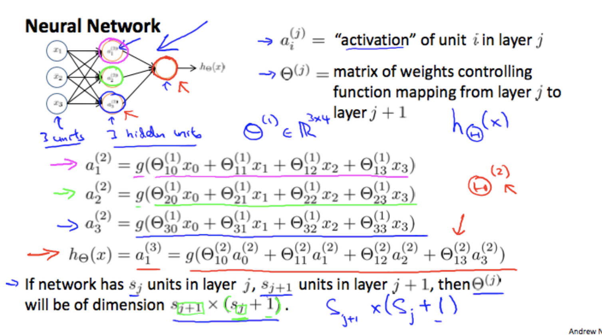
### Model Representation II
- Taking our example of a neural network from the previous section, we can replace the parameters inside our g function with a new variable zk(j) to get: 
  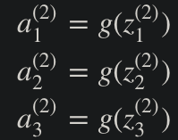
  - In other words, for layer j = 2 and node k, the variable z will be: 
    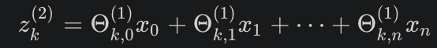
  - The vector representatin of x and zj is: 
    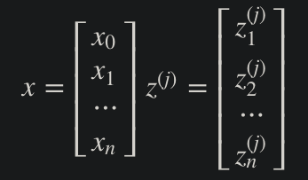
  - Setting x = a(1), we can rewrite the equation as: 
    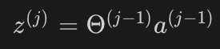
- We are multiplying our matrix &Theta;(j-1) with dimensions *sj x (n + 1)* (where sj is the number of our activation nodes) by our vector a(j-1) with height (n+1). This gives us our vector z(j) with height sj. Now we can get a vector of our activation nodes for layer j as follows: 
  *a(j) = g(z(j))*
where our function g can be applied element-wise to our vector z(j).
- We can then add a bias unit (equal to 1) to layer j after we have computed a(j). This will be element a0(j) and will be equal to 1. To compute our final hypotehsis, let's first compute another z vector: 
  z(j+1) = &Theta;(j)a(j)
- We get this final z vector by mulitplying hte next theta matrix after &Theta;(j-1) with the values of all the activation nodes we just got. This last theta matrix &Theta;(j) will have only **one row** which is multiplied by one column a(j) so that our result is a single number. We then get our final result with: 
  h&Theta;(x) = a(j+1) = g(z(j+1))
  - Notice that in this **last step**, between layer j and layer j+1, we are doing **exactly the same thing** as we did in loigist regression. Adding all these intermediate layers in nerual networks allow us to more elegantly produce interesting and more complex linear hypothesis.

## Applications

### Examples and Intuitions I
- A simple example of a neural network is attempting to map out the logical AND function, where the output is 1 (or true) **only** when both x1 and x2 are both 1.
- The graph of our functions will look like: 
  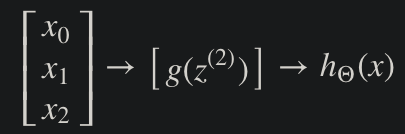
  - Remember that x0 is our bias variable and is always 1
- Let's set our first theta matrix as: &Theta;(1) = [-30 20 20]
- This will cause the output of our hypothesis to only be positive if both x1 and x2 are 1: 
  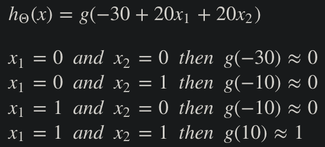
- The following is an example of the logical OR operator: 
  
- Where g(z) is the following: 
  
### Examples and Intuitions II
- 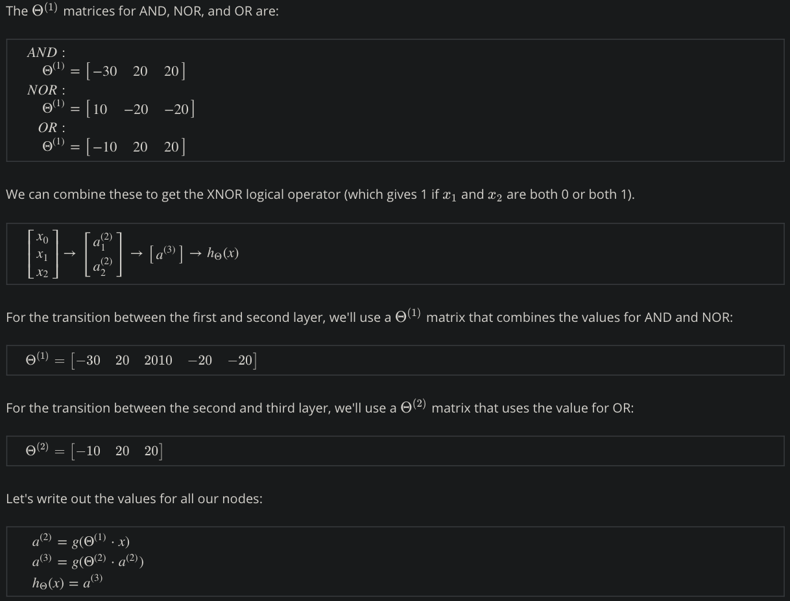
- And there we hav ethe XNOR operator using a hidden layer with two nodes! The following summarizes the above algorithm: 
  
### Multiclass Classification
- 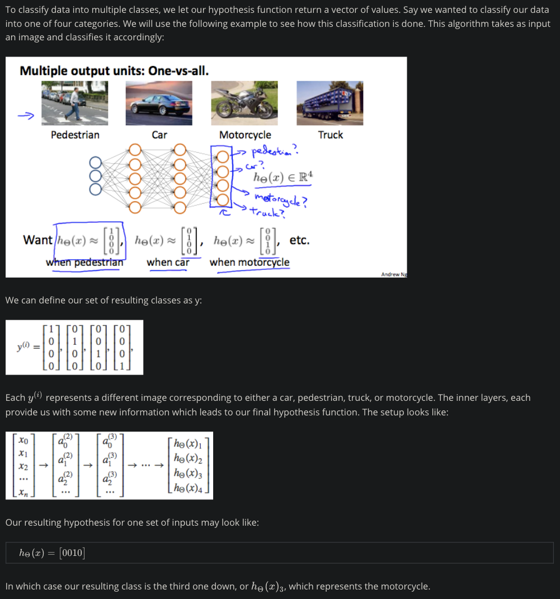