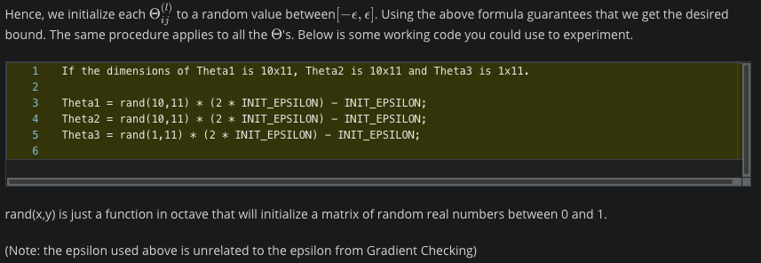
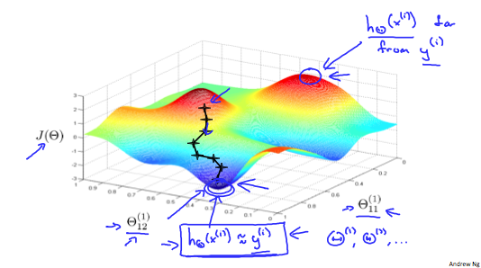

# Week 5 Notes

## Cost Function and Backpropagation

### Cost Function
- L = total number of layers in the network
- sl = number of units (not counting bias unit) in layer l
- K = number of output units/classes
- Cost function for regularized logistic regression: 
  
- Cost function for neural networks: 
  
  - Additional nested summation that loops through the number of output nodes
  - For regularization, we must account for multiple theta matrices
    - The number of columns in our current theta matrix is equal to the number of nodes in our current layer (including the bias unit)
    - The number of rows in our current theta matrix is equal to the number of nodes in the next layer (excluding the bias unit)
### Backpropagation Algorithm
- "Backpropagation" is neural-network terminology for minizing our cost function, similar to what we were doing with gradient descent in logistic regression and linear regression: 
  
- 
### Backpropagation Intuition
- 
- Recall that our derivative is the slope of a line tangent to the cost function, so the steeper the slope the more incorrect we are. Let us consider the following neural network below and see hwo we could calculate some &delta;j(l): 
  

## Backpropagation in Practice

### Implementation Note: Unrolling Parameters
- 
- To summarize 
  
### Gradient Checking
- 
### Random Initialization
- Initializing all theta weights to zero does not work with neural networks. When we backpropagate, all nodes will update to the same value repeatedly. Instead we can randomly initialize our weights for our &Theta; matrices using the following method: 
  
- 
### Putting It Together
- 
- The following image gives us an intuitionf o what is happening as we are implementing our neural network: 
  
  - Ideally, you want h&Theta;(x(i)) &approx; y(i). This will minimize our cost function. However, keep in mind that J(&Theta;) is not convex and thus we can end up in a local minimum instead.