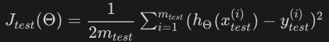
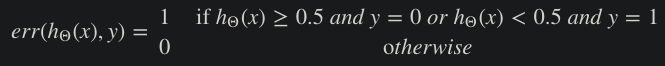
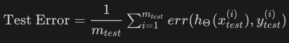

# Week 6 Notes

## Evaluating a Learning Algorithm

### Evaluating a Hypothesis
- Once we have done some trouble shooting for errors in our predictions by:
  - Getting more training example
  - Trying smaller sets of features
  - Trying additional features
  - Trying polynomial features
  - Increasing or decreasing &lambda
- We can move on to evaluate our new hypothesis.
- A hypothesis may have a low error for the training examples but still be inaccurate (because of overfitting). Thus, to evaluate a hypothesis, given a dataset of training examples, we can split up the data into two sets: a **training set** and a **test set**. Typically, the training set consists of 70% of your data and the test set is the remaining 30%.
- The new procedure using these two sets is then:
  1. Learn &Theta; and minimuze Jtrain(&Theta;) using the training set
  2. Compute the test set error Jtest(&Theta;)
- The test set error
  1. For linear regression: 
     
  2. For classification ~ Misclassification error (aka 0/1 misclassification error): 
     
     - This gives us a binary 0 or 1 error result based on a misclassification. The average test error for the test set is: 
       
     - This gives us the proportion of the test data that was misclassified.
### Model Selection and Train/Validation/Test Sets
- Just because a learning algortihm fits a training set well, that does not mean it is a good hypothesis. It could over fit as a result of your predictions on the test set would be poor. The error of your hypthesis is measured on the data set with which you trained the parameters will be lower than the error on any other data set.
- Given many models with different polynomial degrees, we can use a systematic approach to identify the "best" function. In order to choose the model of your hypothesis, you can test each degree of polynomial and look at the error result.
- One way to break down our data into the three sets is:
  - Training set: 60%
  - Cross validation set: 20%
  - Test set: 20%
- We can now calculate three separate error values for the three different sets using the following method:
  1. Optimize the parameters in &Theta; using the training set for each polynomial degree.
  2. Find the polynomial degree d with the least error using the cross validation set.
  3. Estimate the generalization error using the test set with Jtest(&Theta;(d)) (d = theta from polynomial with lower error)
- This way, the degree of the polynomial d has not been trained using the test set.

## Bias vs. Variance

### Diagnosing Bias vs. Variance
- We need to distinguish whether **bias** or **variance** is the problem contributing to bad predictions.
- High bias is underfitting and high variance is overfitting. Ideally, we need to find the golden mean between these two.
- The training error will tend to **decrease** as we increase the degree d of the polynomial
- The cross validation error will tend to **decrease** as we increase d up to a point, but then will **increase** as d is increased, forming a convex curve
- **High Bias (underfitting)**: Both Jtrain(&Theta;) and JCV(&Theta;) will be high, and JCV(&Theta;) &approx; Jtrain(&Theta;)
- **High Variance (overfitting)**: Jtrain(&Theta;) will be low and JCV(&Theta;) will be much greater than Jtrain(&Theta;)
- 
### Regularization and Bias/Variance
- 
  - We see that as &lambda; increases, our fit becomes more rigid, and on the other hand, as &lambda; approaches 0, we tend to overfit the data. In order to choose the model and the regularization term &lambda; to be "just right," we need to:
    1. Create a list of lambdas (i.e. &lambda; &in; {0, 0.01, 0.02 0.04, 0.08, 0.32, 0.64, 1.28, 2.56, 5.12, 10.24})
    2. Create a set of models with different degrees or any other variants
    3. Iterate through the &lambda;s and for each &lambda; go through all the models and learn some &Theta;
    4. Compute the cross validation error using the learned &Theta; (computed with &lambda;) on the JCV(&Theta;) **without** regularization or &lambda; = 0
    5. Select the best combo that produces the lowest error on the cross validation set
    6. Using the best combo &Theta; and &lambda;, apply it on Jtest(&Theta;) to see if it has a god generalization of the problem
### Learning Curves
- Training an algorithm on very few data points will easily have 0 errors because we can always find a quadratic curve that touches exactly those number of points, therefore:
  - As the training set gets larger, the error for a quadratic function increases
  - The error value will plateau out after a certain m, or training set size
- #### Experiencing high bias:
  - **Low training set size**: causes Jtrain(&Theta;) to be low and JCV(&Theta;) to be high
  - **Large training set size**: causes both Jtrain(&Theta;) and JCV(&Theta;) to be high with Jtrain(&Theta;) &approx; JCV(&Theta;)
  - If a learning algorithm is suffering from **high bias**, getting more training data will not (**by itself**) help much: 
    
- #### Experiencing high variance:
  - **Low training set size**: Jtrain(&Theta;) will be low and JCV(&Theta;) will be high
  - **Large training set size**: Jtrain(&Theta;) increases with training set size and JCV(&Theta;) continues to decrease without leveling off. Also, Jtrain(&Theta;) &lt; JCV(&Theta;) but the difference between them remains significant
  - If a learning algorithm is suffering from **high variance**, getting more training data is likely to help: 
    
### Deciding What to do Next Revisited
- **Getting more training examples**: Fixes high variance
- **Trying smaller sets of features**: Fixes high variance
- **Adding features**: Fixes high bias
- **Adding polynomial features**: Fixes high bias
- **Decreasing &lambda;**: Fixes high bias
- **Increasing &lambda;**: Fixes high variance
- #### Diagnosing Neural Networks
  - A neural network with fewer parameters is **prone to underfitting**, but it is **computationally cheaper**
  - A large neural network with more parameters is **prone to overfitting**, but is also **computationally expensive**, and in this case we can use regularization (increase &lambda;) to address the overfitting
  - Using a single hidden layer is a good default, and you can train your neural network on a number of hidden layers using your cross validation set, and then select the one that performs the best
- #### Model Complexity Effects
  - Lower-order polynomials (low model complexity) have high bias and low variance. In this case, the model fits poorly consistently
  - Higher-order polynomials (high model complexity) fit the training data extremely well and the test data extremely poorly. These have low bias on the training data, but very high variance
  - In reality, we would want to choose a model somwhere in between, that can generalize well but also fits the data reasonably well